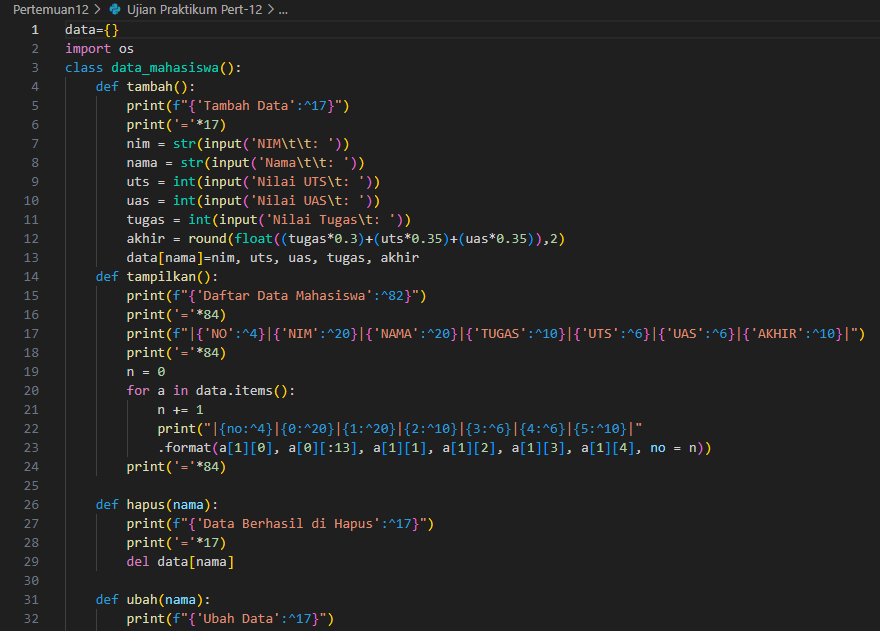
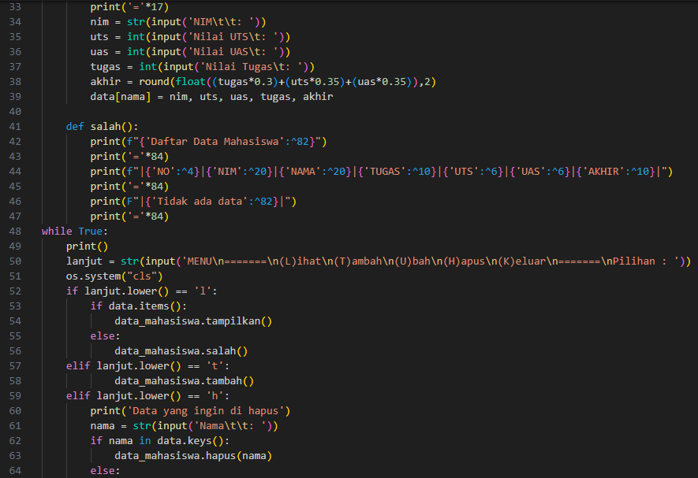
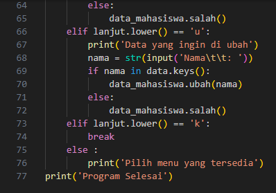
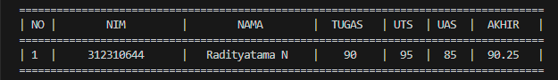
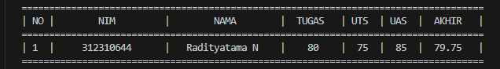
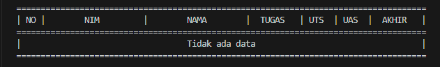

# LabPy08

# OOP(Objek Oriented Programing)

# Tampilan Dari Program

# Hasil Dari Program

# Input Tambah Data(T)

# Input Ubah Data(U)

# Input Hapus Data(H)

# Program Diagram Class

# Sistem Flowchart

